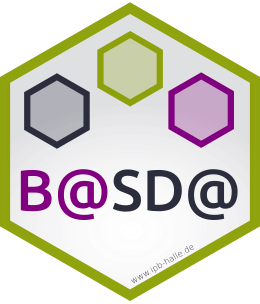

# The BASDA group sticker

* Package URL: http://bioconductor.org/packages/xcms
* Sticker maintainer: [Steffen Neumann](https://www.ipb-halle.de/en/employee/steffen-neumann/)
* License: Creative Commons Attribution
  [CC-BY](https://creativecommons.org/licenses/by/4.0/). Feel free to
  share and adapt, but don't forget to credit the author.

The sticker was generated using InkScape, based on the IPB Sticker by Jonas
Kessel.

In case you need different versions, check out the `Makefile` how to convert.

