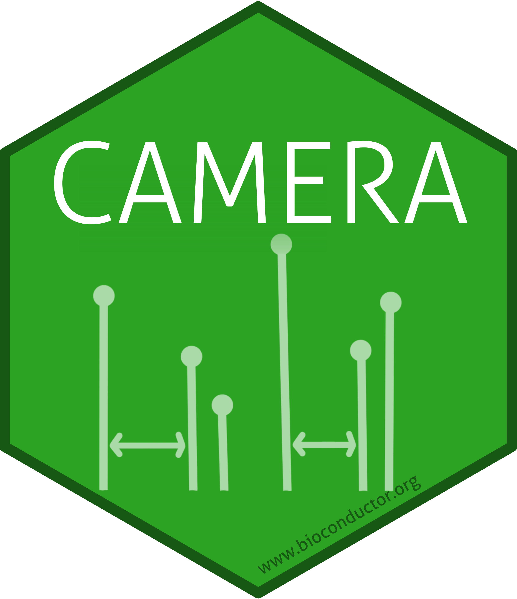

# The `CAMERA` package sticker

* Package URL: http://bioconductor.org/packages/CAMERA
* Sticker maintainer: [Kristian Peters](https://github.com/korseby/)
* License: Creative Commons Attribution
  [CC-BY](https://creativecommons.org/licenses/by/2.0/). Feel free to
  share and adapt, but don't forget to credit the author.

The sticker was generated using
the [`CAMERA_hexSticker.R`](./CAMERA_hexSticker.R) `R` script that uses
the [`hexSticker`](https://github.com/GuangchuangYu/hexSticker) package.

